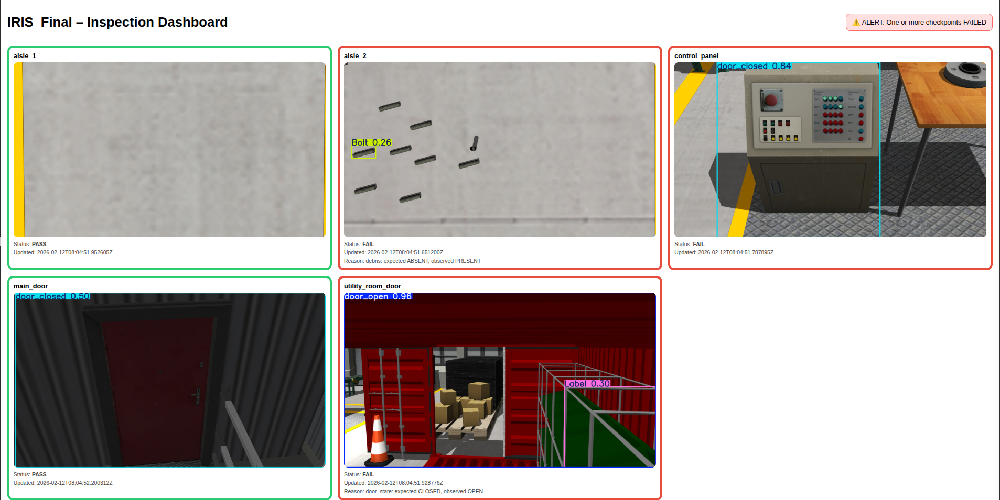
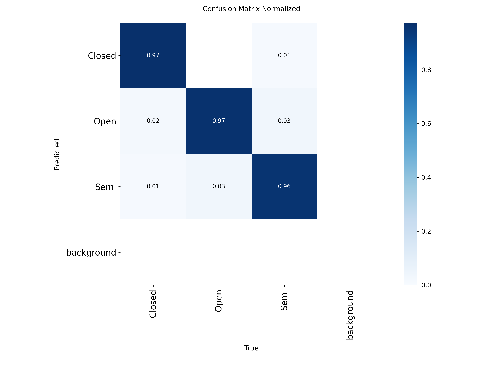
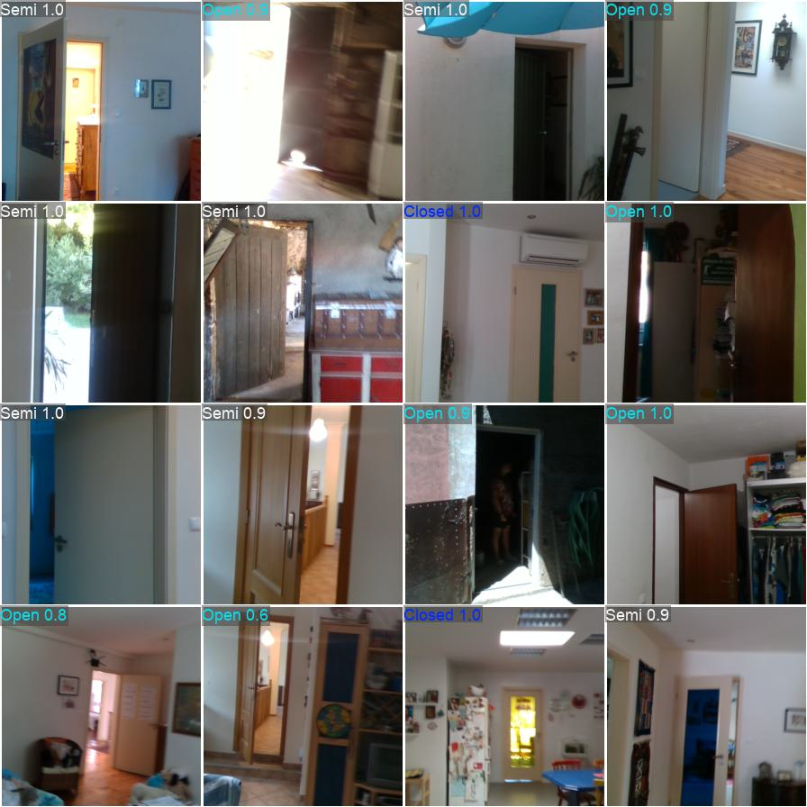
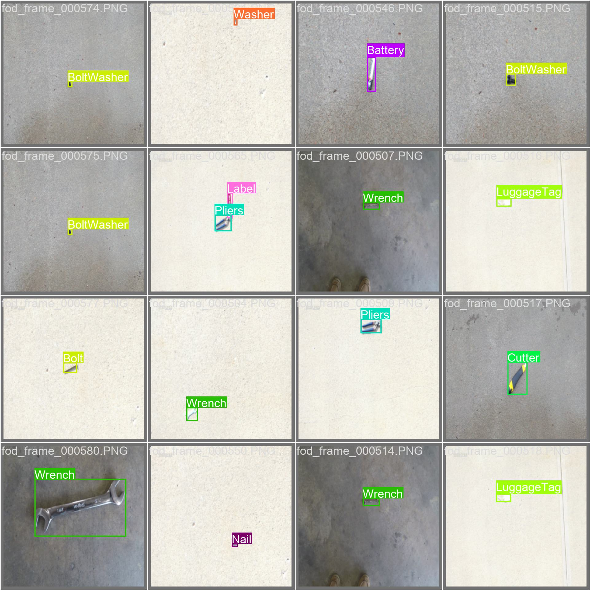
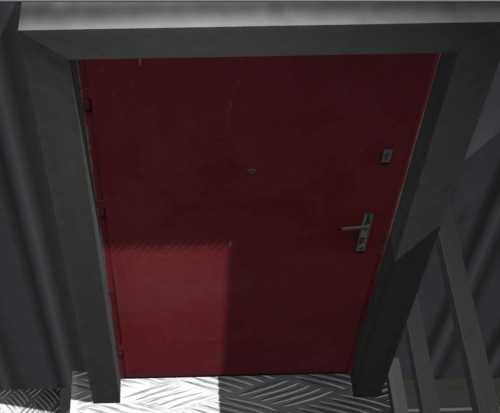
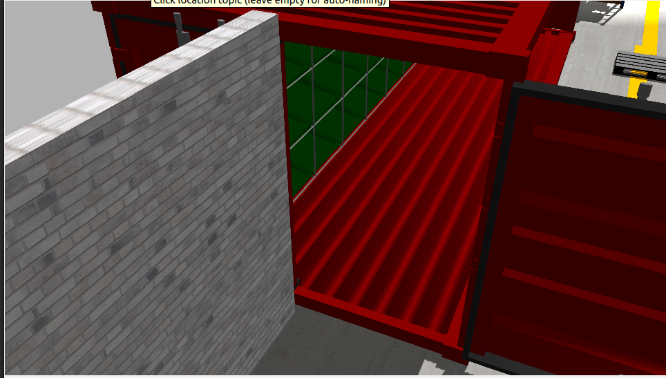
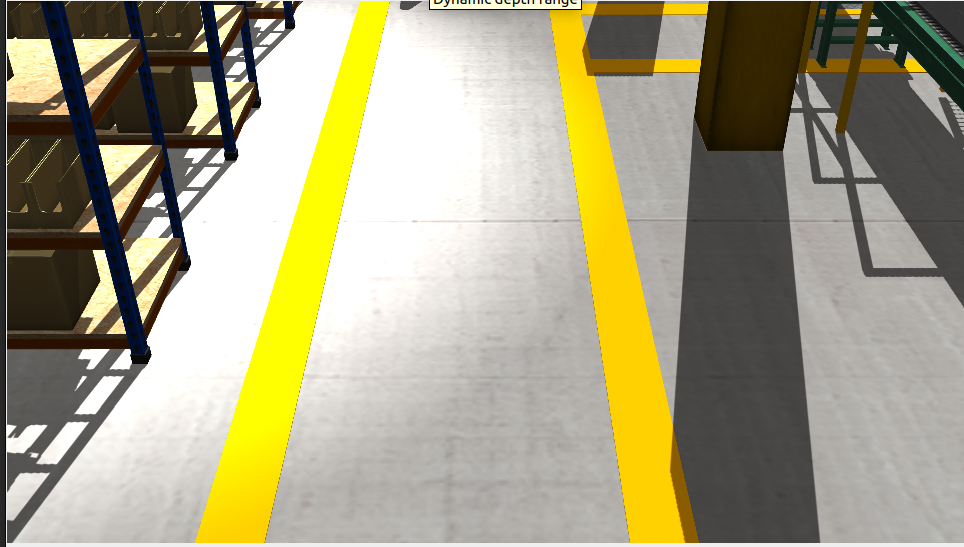
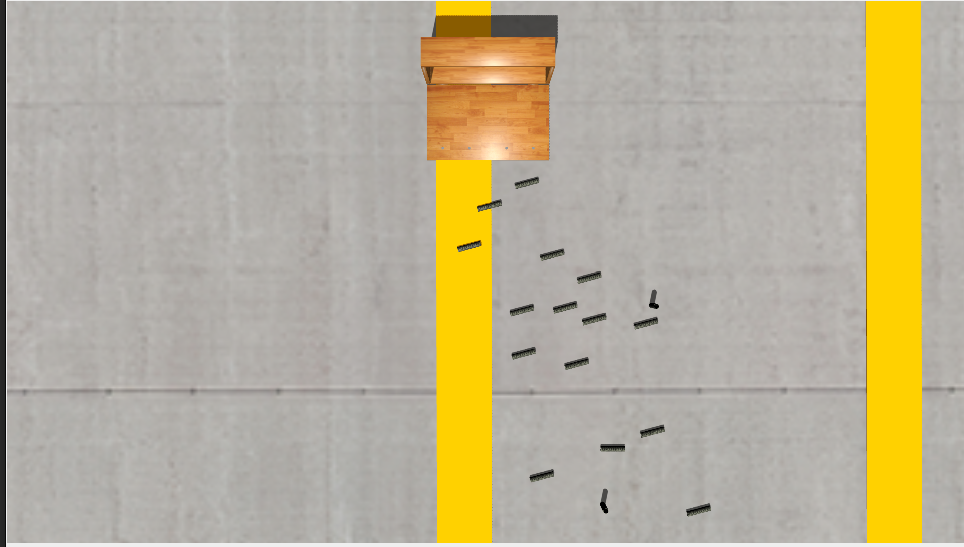
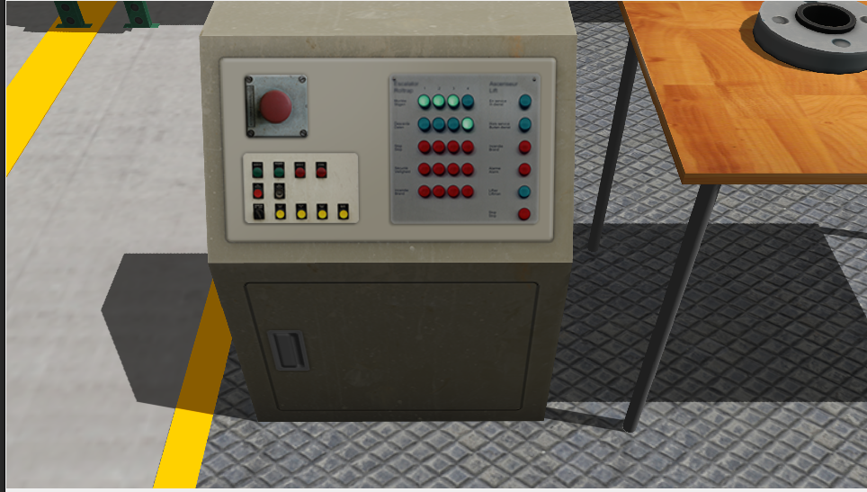

# IRIS – Inspection & Reporting Intelligence System

---

## Overview

**IRIS** is a demo-ready inspection & reporting intelligence prototype designed to:

- Visually inspect a facility
- Evaluate operational conditions
- Detect deviations from expected states
- Produce structured, audit-ready inspection outputs
- Trigger real-time UI alerts for failures

This prototype focuses on:

> **Perception → Condition Evaluation → Structured Reporting → Operator Alerting**

---

## Demo Video

[](https://drive.google.com/file/d/1mfZcA0ukRAOetbd4Nhtyr6j0WYDX-CaQ/view?usp=drive_link)

---
## Environment Requirements

- Ubuntu 22.04
- ROS2 Humble
- Gazebo Classic
- Python 3.10
- NVIDIA GPU (optional but recommended)

---

## Python Dependencies

Installed using system python:

```bash
python3 -m pip install --user \
  "numpy==1.26.4" \
  "opencv-python==4.10.0.84" \
  ultralytics \
  flask \
  pyyaml
```

---

# What is Simulated vs Real and Assumptions

## Simulated

- Facility environment (Gazebo)
- Camera feeds
- Physical layout

## Real

- YOLO model trained on real images
- Detection logic
- Condition evaluation engine
- Structured inspection output model
- Dashboard architecture

## Assumptions

- Cameras are fixed
- Each camera maps to one checkpoint
- Debris detection uses generic object detection
- Control panel condition not implemented in v1

---

## Mock Facility


---

## Inspection Checkpoints

| Checkpoint ID       | Description         | Expected Condition |
|--------------------|--------------------|--------------------|
| `main_door`        | Main entry door     | CLOSED             |
| `utility_room_door`| Utility room door   | CLOSED             |
| `aisle_1`          | Aisle 1             | No debris present  |
| `aisle_2`          | Aisle 2             | No debris present  |
| `control_panel`    | Control panel       | ON (placeholder in v1) |

---

## System Architecture
``` bash
Gazebo Simulation (5 Cameras)
            ↓
ROS2 Topics (/camX/rgb/image_raw)
            ↓
IRIS ROS Node
            ↓
YOLOv8 Inference (Door + Debris)
            ↓
Condition Evaluator (Rule-based)
            ↓
Structured Output Writer
            ↓
JSON Files (latest.json + events.jsonl)
            ↓
Flask Dashboard UI
            ↓
Real-time PASS/FAIL + Alerts
```

---

## Directory Structure
``` bash
IRIS/
│
├── configs/
│ ├── topics.yaml
│ ├── checkpoints.yaml
│ └── model.yaml
│
├── weights/
│ └── best.pt
│
├── outputs/
│ ├── current/
│ │ ├── latest.json
│ │ ├── events.jsonl
│ │ └── images/
│ └── runs/
│
├── src/
│ ├── ros/
│ │ └── iris_node.py
│ ├── perception/
│ │ └── yolo_infer.py
│ ├── inspection/
│ │ ├── evaluator.py
│ │ └── writer.py
│ └── ui/
│ ├── app.py
│ ├── templates/
│ └── static/
│
└── scripts/
├── run_inference_ros.py
└── run_ui.py
```

---

# Development Roadmap

I used structured engineering sprints to develop the **IRIS prototype**, each building toward a complete inspection & reporting intelligence pipeline.

---

## Sprint 1 — Door State Detection Engine

**Objective:** Detect whether facility doors are open, closed, or partially open/close.

### Deliverables

- Custom YOLOv8 model trained on door-state dataset
- Multi-class classification:
    - `door_open`
    - `door_closed`
    - `door_semi`
- Inference validation on static test images
- Confidence thresholding and class mapping logic

### Outcome

Established the first inspection condition:

> Open vs Closed state detection for physical access points.


Normalised confusion matrix


Door state prediction

---

## Sprint 2 — Debris & Obstruction Detection

**Objective:** Detect foreign objects or debris in operational aisles.

### Deliverables

- Extended YOLO training to include object categories
- Debris presence detection logic
- Rule-based condition evaluation:
    - `PRESENT`
    - `ABSENT`
- Failure trigger logic for obstruction scenarios

### Outcome

Enabled environmental safety monitoring:

> Automatic aisle clearance validation.


---

## Sprint 3 — Simulated Inspection Environment

**Objective:** Create a realistic facility simulation to validate perception pipeline end-to-end.

### Deliverables

- Custom Gazebo world configuration
- 5 inspection checkpoints
- Fixed camera placement at:
    - Main Door
    - Utility Room Door
    - Aisle 1
    - Aisle 2
    - Control Panel
- ROS2 image topics for each camera:

```
/cam1/rgb/image_raw
/cam2/rgb/image_raw
/cam3/rgb/image_raw
/cam4/rgb/image_raw
/cam5/rgb/image_raw
```

### Outcome

Created a controlled, repeatable testing environment bridging simulation with real ML models.

This marked the transition from isolated model validation to system-level integration.








---

## Sprint 4 — Model Consolidation

**Objective:** Merge Door and Debris detection into a single unified YOLO model.

### Deliverables

- Consolidated dataset
- Unified multi-class detection model
- Simplified inference pipeline
- Centralized condition evaluation logic

### Outcome

Reduced system complexity and improved performance by:

- Eliminating multi-model orchestration
- Reducing GPU overhead
- Simplifying evaluation rules

This was a key architectural milestone.


---

## Sprint 5 — Real-Time Inspection Execution & Dashboard

**Objective:** Execute live inspection on simulated camera feeds and visualize results.

### Deliverables

- ROS2 subscription node
- YOLO inference on streaming camera data
- Condition evaluator engine
- Structured output writer:
    - `events.jsonl`
    - `latest.json`
- Annotated image saving
- Flask-based real-time dashboard
- Visual PASS/FAIL indicators
- Global alert banner on failures

### Outcome

Designed a complete inspection intelligence loop:

```
Camera Input
     ↓
ML Perception
     ↓
Condition Evaluation
     ↓
Structured Audit Output
     ↓
Operator Alert Interface
```

### UI Features

- Real-time refresh (1 second polling)
- Visual PASS/FAIL borders
- Alert banner when any checkpoint fails
- Annotated inference images
- Failure reason explanation


---

# Running the System

---

## Step 1 — Launch Gazebo

Export the model paths that are used in the Gazebo model.

```bash
export GAZEBO_MODEL_PATH="$HOME/IRIS_Final/sim/gazebo/worlds/factory/models:$GAZEBO_MODEL_PATH"
```

Launch the model.

```bash
gazebo "$HOME/Data center simulation/gazebo_worlds_models/worlds/factory/factory.model"
```

Verify camera topics:

```bash
ros2 topic list | grep image
```

Expected:

```
/cam1/rgb/image_raw
/cam2/rgb/image_raw
/cam3/rgb/image_raw
/cam4/rgb/image_raw
/cam5/rgb/image_raw
```

---

## Step 2 — Run Inference Node

Open new terminal (Terminal A):

```bash
source /opt/ros/humble/setup.zsh
cd ~/IRIS
python3 scripts/run_inference_ros.py
```

You should see:

```
Subscribing main_door -> /cam1/rgb/image_raw
Subscribing utility_room_door -> /cam2/rgb/image_raw
...
```

The node will now:

- Subscribe to 5 camera feeds
- Run YOLO inference (throttled)
- Evaluate conditions
- Save annotated images
- Write structured outputs

---

## Step 3 — Run Dashboard UI

Open another terminal (Terminal B):

```bash
cd ~/IRIS
python3 scripts/run_ui.py
```

Open browser:

```
http://127.0.0.1:5000
```

---

# Inspection Output Model

For each checkpoint, the system generates:

---

## Event Structure (`events.jsonl`)

```json
{
  "timestamp_utc": "2026-02-12T01:33:16Z",
  "checkpoint_id": "utility_room_door",
  "result": "FAIL",
  "conditions": [
    {
      "name": "door_state",
      "expected": "CLOSED",
      "observed": "OPEN",
      "pass": false,
      "confidence": 0.91
    }
  ],
  "image_ref": "outputs/current/images/utility_room_door.jpg"
}
```

---

## `latest.json` (UI Source)

Contains the most recent state of each checkpoint.

Used by dashboard to render:

- Green border → PASS
- Red border → FAIL
- Global alert banner if any FAIL

---

# Condition Evaluation Logic

## Door State

Detected classes:

- `door_open`
- `door_closed`
- `door_semi`

Mapping:

```
door_closed → CLOSED
door_open   → OPEN
door_semi   → SEMI
```

PASS if `observed == expected`.

---

## Debris Detection

Any detected object that is **NOT a door class** is considered debris.

If any debris detected:

```
observed = PRESENT
```

Otherwise:

```
observed = ABSENT
```

---

# Future Improvements

- Add indicator light detection
- Add control panel ON/OFF detection
- Add confidence-based threshold gating
- Add inspection run summaries
- Add database persistence
- Add PDF inspection report export
- Add real robot integration layer
- Add anomaly confidence scoring
- Add temporal smoothing across frames

---

# Conclusion

IRIS demonstrates a working inspection intelligence pipeline:

- Multi-camera perception
- ML-based condition detection
- Rule-based evaluation
- Structured audit output
- Real-time operator alerting

It serves as a foundation for scalable inspection systems.