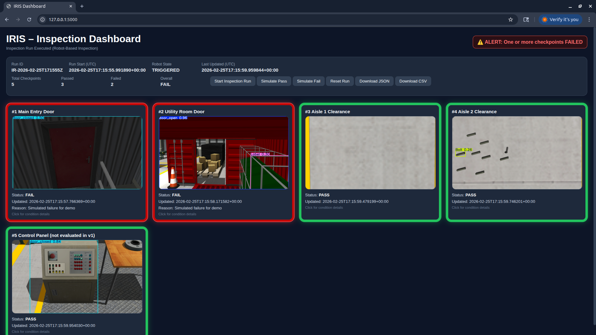

# IRIS – Inspection & Reporting Intelligence System

IRIS is a modular inspection intelligence prototype that integrates computer vision, robotics simulation, rule-based condition evaluation, and structured reporting into a unified audit-ready system.

It demonstrates how ML-based perception can be transformed into actionable industrial inspection workflows with explainability, structured outputs, and real-time operator feedback.

## Overview

**IRIS** is a demo-ready inspection & reporting intelligence system designed to:

- Visually inspect a facility
- Evaluate operational conditions
- Detect deviations from expected states
- Produce structured, audit-ready inspection outputs
- Trigger real-time UI alerts for failures

The system implements a complete inspection intelligence loop:

> **Perception → Condition Evaluation → Structured Reporting → Operator Alerting**

## Demo Video

[](https://drive.google.com/file/d/1NcH1qxkYDtGzhIfxNt4G38O1iWb1FKg4/view?usp=sharing)

## Tech Stack

- Python 3.10
- ROS2 Humble
- Gazebo Classic
- YOLOv8 (Ultralytics)
- OpenCV
- Flask
- JSONL structured logging
- Rule-based condition evaluation engine

## Environment Requirements

- Ubuntu 22.04
- ROS2 Humble
- Gazebo Classic
- Python 3.10
- NVIDIA GPU (optional but recommended)

## Python Dependencies

Installed using system python:

```bash
python3 -m pip install --user \
  "numpy==1.26.4" \
  "opencv-python==4.10.0.84" \
  ultralytics \
  flask \
  pyyaml
```

## What is Simulated vs Real

### Simulated

- Facility environment (Gazebo)
- Camera feeds
- Physical layout

### Real

- YOLO model trained on real images
- Detection logic
- Condition evaluation engine
- Structured inspection output model
- Dashboard architecture

### Assumptions

- Cameras are fixed
- Each camera maps to one inspection checkpoint
- Debris detection uses generic object detection
- Control panel condition not implemented in Version 1

## Mock Facility


## Inspection Checkpoints

| Checkpoint ID        | Description           | Expected Condition |
|----------------------|----------------------|--------------------|
| `main_door`          | Main entry door      | CLOSED             |
| `utility_room_door`  | Utility room door    | CLOSED             |
| `aisle_1`            | Aisle 1              | No debris present  |
| `aisle_2`            | Aisle 2              | No debris present  |
| `control_panel`      | Control panel        | ON (placeholder in v1) |

## System Architecture

```
Gazebo Simulation (5 Cameras)
            ↓
ROS2 Topics (/camX/rgb/image_raw)
            ↓
IRIS ROS Node
            ↓
YOLOv8 Inference (Door + Debris)
            ↓
Condition Evaluator (Rule-Based)
            ↓
Structured Output Writer
            ↓
JSON Files (latest.json + events.jsonl)
            ↓
Flask Dashboard UI
            ↓
Real-Time PASS/FAIL + Alerts
```

# Development Roadmap

IRIS was developed using structured engineering sprints, each progressively building toward a complete inspection & reporting intelligence pipeline.

## Sprint 1 — Door State Detection Engine

### Objective
Detect whether facility doors are open, closed, or partially open.

### Deliverables

- Custom YOLOv8 model trained on door-state dataset
- Multi-class classification:
  - `door_open`
  - `door_closed`
  - `door_semi`
- Inference validation on static test images
- Confidence thresholding and class mapping logic

### Outcome

Established the first inspection condition:

> Automated access-point state validation (OPEN vs CLOSED vs SEMI).


## Sprint 2 — Debris & Obstruction Detection

### Objective
Detect foreign objects or debris in operational aisles.

### Deliverables

- Extended YOLO training to include object categories
- Debris presence detection logic
- Rule-based condition evaluation:
  - `PRESENT`
  - `ABSENT`
- Failure trigger logic for obstruction scenarios

### Outcome

Enabled environmental safety monitoring:

> Automatic aisle clearance validation.


## Sprint 3 — Simulated Inspection Environment

### Objective
Create a realistic facility simulation to validate the perception pipeline end-to-end.

### Deliverables

- Custom Gazebo world configuration
- 5 inspection checkpoints
- Fixed camera placement at:
  - Main Door
  - Utility Room Door
  - Aisle 1
  - Aisle 2
  - Control Panel
- ROS2 image topics:

```
/cam1/rgb/image_raw
/cam2/rgb/image_raw
/cam3/rgb/image_raw
/cam4/rgb/image_raw
/cam5/rgb/image_raw
```

### Outcome

Created a controlled, repeatable testing environment bridging simulation with real ML models.

This marked the transition from isolated model validation to full system-level integration.


## Sprint 4 — Model Consolidation

### Objective
Merge Door and Debris detection into a single unified YOLO model.

### Deliverables

- Consolidated dataset
- Unified multi-class detection model
- Simplified inference pipeline
- Centralized condition evaluation logic

### Outcome

Reduced system complexity and improved performance by:

- Eliminating multi-model orchestration
- Reducing GPU overhead
- Simplifying evaluation rules


## Sprint 5 — Real-Time Inspection Execution & Dashboard

### Objective
Execute live inspection on simulated camera feeds and visualize results.

### Deliverables

- ROS2 subscription node
- YOLO inference on streaming camera data
- Condition evaluator engine
- Structured output writer:
  - `events.jsonl`
  - `latest.json`
- Annotated image saving
- Flask-based real-time dashboard
- Visual PASS/FAIL indicators
- Global alert banner on failures

### Outcome

Designed a complete inspection intelligence loop:

```
Camera Input
     ↓
ML Perception
     ↓
Condition Evaluation
     ↓
Structured Audit Output
     ↓
Operator Alert Interface
```

### UI Features

- Real-time refresh (1-second polling)
- Visual PASS/FAIL borders
- Alert banner when any checkpoint fails
- Annotated inference images
- Failure reason explanation


# Version 2 – Structured Inspection Runs & Enhanced Execution Model

Version 2 transforms IRIS from a perception demo into a structured inspection execution system.

## Key Enhancements in Version 2

- Inspection Run Lifecycle Tracking
- Multi-Condition Checkpoints
- Condition-Level Explainability
- Downloadable Reports (JSON / CSV)
- Simulation Mode (UI-only execution)

## Structured Inspection Run Model

New structured file:

```
outputs/current/run.json
```

Each run tracks:

- `run_id`
- `start_time_utc`
- `run_state`
- `robot_state`
- `summary`
  - total checkpoints
  - passed
  - failed
  - last_updated_utc
  - overall status

IRIS now behaves like a structured inspection execution engine rather than passive monitoring.

## Condition-Level Drilldown Modal

Clicking a checkpoint displays:

- Condition name
- Expected value
- Observed value
- PASS/FAIL status
- Confidence score
- Failure reason (if applicable)

This adds explainability and audit transparency.

## Multi-Condition Simulation for Demo Mode

In Version 2:

- Each checkpoint generates multiple conditions
- Confidence values are randomized for realism
- PASS scenarios simulate high-confidence detection
- FAIL scenarios simulate mixed or lower-confidence detection

This makes the demo closer to real industrial inspection workflows.

## Downloadable Inspection Reports

Report export includes:

- Run metadata
- Checkpoint sequence
- Condition-level details
- Result status
- Image reference

Formats:
- JSON
- CSV

## Demo Control Execution Modes

### Live Mode

- Gazebo simulation
- ROS2 camera feeds
- YOLO inference
- Real condition evaluation
- Full inspection pipeline

### Sim Mode

- No Gazebo
- No ROS
- UI-only
- Simulated inspection results

This enables hardware-free demos.

## Inspection Output Model

### Event Structure (`events.jsonl`)

```json
{
  "timestamp_utc": "2026-02-12T01:33:16Z",
  "checkpoint_id": "utility_room_door",
  "result": "FAIL",
  "conditions": [
    {
      "name": "door_state",
      "expected": "CLOSED",
      "observed": "OPEN",
      "pass": false,
      "confidence": 0.91
    }
  ],
  "image_ref": "outputs/current/images/utility_room_door.jpg"
}
```

## Condition Evaluation Logic

### Door State

Detected classes:

- `door_open`
- `door_closed`
- `door_semi`

Mapping:

```
door_closed → CLOSED
door_open   → OPEN
door_semi   → SEMI
```

PASS if `observed == expected`.

### Debris Detection

Any detected object that is **not a door class** is considered debris.

If debris detected:

```
observed = PRESENT
```

Otherwise:

```
observed = ABSENT
```

## Running IRIS V2

### Live Mode

```bash
cd ~/IRIS_V2
./run_iris.sh live
```

Manual execution:

```bash
export GAZEBO_MODEL_PATH="$HOME/IRIS_V2/worlds/factory/models:$GAZEBO_MODEL_PATH"
gazebo "$HOME/IRIS_V2/worlds/factory/factory.model"

source /opt/ros/humble/setup.bash
export PYTHONPATH=$(pwd)
python3 src/ros/iris_node.py --mode live

python3 -m src.ui.app
```

---

### Sim Mode

```bash
cd ~/IRIS_V2
./run_iris.sh sim
```

Or:

```bash
export PYTHONPATH=$(pwd)
python3 -m src.ui.app
```

## Why This Architecture Matters

Industrial inspection systems require:

- Deterministic condition evaluation
- Structured audit outputs
- Explainable failure reasons
- Simulation testing before real deployment

IRIS demonstrates how ML perception can be integrated into a structured, auditable inspection execution engine rather than a standalone detection model.

## Future Improvements

- Indicator light detection
- Control panel ON/OFF detection
- Confidence-based threshold gating
- Database persistence
- PDF inspection report export
- Real robot integration layer
- Anomaly confidence scoring
- Temporal smoothing across frames

## Datasets Used

### Doors

- Door detection and classification:  
  https://drive.google.com/drive/folders/1iSrPjO-F2aaB7MmsN7tsU1wnLtnO3euK

- DeepDoors2:  
  https://drive.google.com/drive/folders/1SxVKeJ9RBcoJXHSHw-LWaLGG07BZT-b5

### Gazebo World

- Dataset of Gazebo Worlds Models and Maps:  
  https://github.com/mlherd/Dataset-of-Gazebo-Worlds-Models-and-Maps

## Conclusion

**Version 1** validated ML-based inspection feasibility.  
**Version 2** elevated IRIS into a structured, auditable inspection execution system.

IRIS now serves as a scalable foundation for industrial inspection automation systems combining robotics, perception, structured reasoning, and operator-facing reporting.